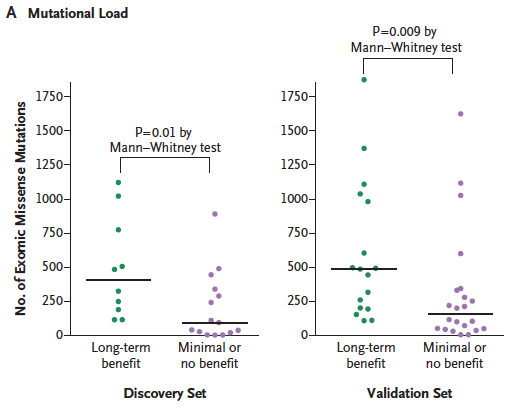
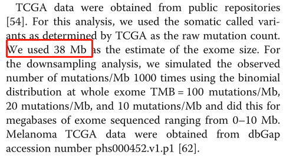

微信ID: epigenomics  E-mail: figureya@126.com

作者：小高

小丫编辑校验

```{r setup, include=FALSE}
knitr::opts_chunk$set(echo = TRUE)
```

## 需求描述

用TCGA的突变数据计算TMB，用某个基因的表达量来分组，画出带散点的box plot，计算p value。



出自<https://www.nejm.org/doi/full/10.1056/NEJMoa1406498>

## 应用场景

借助突变数据，把你的基因跟免疫治疗预后联系起来。

计算出每个sample的TMB，接下来就可以：

- 用某个基因表达量高低来分组，对比不同分组的TMB值。

- 用TMB值高低来分组，做生存分析。

## 输入数据预处理

如果你的数据已经保存成`easy_input_mut.csv`和`easy_input_group.csv`的格式，就可以跳过这步，直接进入“输入文件”。

### 从TCGA下载突变数据

TCGA已经给出了somatic mutation信息，因此，计算TMB非常简单方便。

此处以LIHC为例：

```r
#source("https://bioconductor.org/biocLite.R")
#biocLite("TCGAbiolinks")
#biocLite("maftools")
require(TCGAbiolinks)
require(maftools)

#下载突变数据
LIHC_mutect2 <- GDCquery_Maf(tumor = "LIHC", pipelines = "mutect2")

#确认是否都是somatic mutation
levels(factor(LIHC_mutect2$Mutation_Status))
```

没错，都是somatic mutation

接下来，有两种方法获得每个sample的variants数：

- 方法一：直接使用自带的variants.per.sample

```r
#用maftools里的函数读取maf文件
var_maf <- read.maf(maf = LIHC_mutect2, isTCGA = T)
str(var_maf)

#并且已经统计好了每个sample里的variants数量
variants_per_sample <- var_maf@variants.per.sample
dim(variants_per_sample)
#保存到文件
write.csv(variants_per_sample, "easy_input_mut1.csv", quote = F, row.names = F)
```

- 方法二：自己计算每个sample的variants数量

在这个过程中可以删一下 silent 或其他你想删除的行

```r
require(dplyr)

mutect.dataframe <- function(x){
  #删除Silent的行
  #cut_id <- x$Variant_Classification == "Silent"
  #x <- x[!cut_id,]
  somatic_sum <- x %>% group_by(Tumor_Sample_Barcode) %>% summarise(TCGA_sum = n())
}
variants_per_sample <- mutect.dataframe(LIHC_mutect2)
dim(variants_per_sample)
head(variants_per_sample)

#保存到文件
write.csv(variants_per_sample, "easy_input_mut2.csv", quote = F, row.names = F)
```

对比两种方法获得的variants_per_sample：

```{r}
require(stringr)

mut1 <- read.csv("easy_input_mut1.csv")
mut2 <- read.csv("easy_input_mut2.csv")
mut2$Tumor_Sample_Barcode <- str_sub(mut2$Tumor_Sample_Barcode,1, 12)
mut12 <- merge(mut1, mut2, by = "Tumor_Sample_Barcode")
colnames(mut12) <- c("Tumor_Sample_Barcode","mut1","mut2")
head(mut12)
cor(as.numeric(mut12$mut1),as.numeric(mut12$mut2))
```

### 从TCGA下载表达数据

如果你已经有表达数据，就可以跳过这步，直接进入“根据表达量给sample分组”

```r
expquery <- GDCquery(project = "TCGA-LIHC", 
                data.category = "Transcriptome Profiling",
                data.type = "Gene Expression Quantification",
                workflow.type = "HTSeq - FPKM")
GDCdownload(expquery)
expquery2 <- GDCprepare(expquery)
expMatrix <- TCGAanalyze_Preprocessing(expquery2)
dim(expMatrix)
expMatrix[1:3,1:4]

#只取肿瘤组织
group_list <- ifelse(substr(colnames(expMatrix),14,14)=='0','tumor','normal')
expMatrix_tumor <- expMatrix[,group_list=='tumor']
dim(expMatrix_tumor)

#保存一个基因的表达量，此处选取TP53
write.csv(expMatrix_tumor["ENSG00000141510",], "easy_input_expr.csv", quote=F, row.names = T)
```

### 根据表达量给sample分组

easy_input_expr.csv，某个基因在各个sample里的表达量。

第一列是sample ID，与突变数据里的sample ID一致；第二列是基因的表达量。

```{r}
require(stringr)

myGene <- read.csv("easy_input_expr.csv")
colnames(myGene) <- c("Tumor_Sample_Barcode","Expr") #改列名
#保留barcode的前三个label
myGene$Tumor_Sample_Barcode <- str_sub(myGene$Tumor_Sample_Barcode,1, 12)
head(myGene)

#用表达量中值分为两组
myGene$Expr_level <- ifelse(myGene$Expr > median(myGene$Expr),"TP53_high","TP53_low")
write.csv(myGene[,c(1,3)], "easy_input_group.csv", quote = F, row.names = F)
```

## 输入文件

包含两个输入文件：

- easy_input_mut*.csv，每个sample中的variants总数。

- easy_input_group.csv，样品分组。

```{r}
library(stringr)

#突变
#myMut <- read.csv("easy_input_mut1.csv")
myMut <- read.csv("easy_input_mut2.csv")
colnames(myMut) <- c("Tumor_Sample_Barcode","Variants")
#保留barcode的前三个label
myMut$Tumor_Sample_Barcode <- str_sub(myMut$Tumor_Sample_Barcode,1, 12)
head(myMut)

#分组
myGroup <- read.csv("easy_input_group.csv")
head(myGroup)
```

## 计算TMB

TCGA用的是GRCh38参考基因组，长度约**35Mb**。

```{r}
TMB_per_sample <- myMut
TMB_per_sample$TMB <- myMut$Variants%/%35 #或38

#把TMB值保存到文件，自己设定阈值，就可以用高低TMB分组进行生存分析
write.csv(TMB_per_sample, "TMB_output.csv", quote = F, row.names = F)
```

或者参考这篇：<https://genomemedicine.biomedcentral.com/articles/10.1186/s13073-017-0424-2>

用的是TCGA的mutect_mutation，**38M**，详情见：WES analysis of TCGA data



## 对比分组的TMB

```{r}
TMB_clinical_mRNA <- merge(TMB_per_sample, myGroup, by="Tumor_Sample_Barcode")
head(TMB_clinical_mRNA)
TMB_clinical_mRNA$Expr <- as.numeric(TMB_clinical_mRNA$Expr)

#可以先用‘Mann-Whitney’ test看一下pvalue
res <- wilcox.test(TMB ~ Expr_level, data = TMB_clinical_mRNA,
                   paired = FALSE, #whether you want a paired test
                   exact = FALSE)
(pvalue <- res$p.value)
```

## 开始画图

在画图的时候直接算p value

```{r, fig.width = 3, fig.height = 4}
require(ggplot2)
require(ggpubr)
#ggpubr下载
# if(!require(devtools)) install.packages("devtools")
# devtools::install_github("kassambara/ggpubr")

p <- ggplot(TMB_clinical_mRNA, aes(x = Expr_level, y = TMB, color = Expr_level)) +
  geom_boxplot(outlier.color = NA) + #隐去箱线图上的异常点

  scale_color_manual(values = c("darkgreen", "darkorchid3")) +
  
  #two-sample Wilcoxon tests，也就是‘Mann-Whitney’ test
  stat_compare_means(paired = F, #whether you want a paired test
                     label.y = max(TMB_clinical_mRNA$TMB)*1.1) + #label的位置
  
  theme_bw() + #去除背景色
  theme(panel.grid =element_blank()) + #去除网格线
  theme(panel.border = element_blank()) + #去除外层边框
  theme(axis.line = element_line(colour = "black")) + #沿坐标轴显示直线
  xlab("Discovery Set") + 
  guides(color=FALSE) #不显示图例

#绘制Wikinson点图
p + geom_dotplot(binaxis = "y", #沿y轴堆积，并沿着x轴分组
               binwidth = 0.5, #最大组距
               dotsize = 1, #点的大小
               #如果点太多，两组叠在一起，就需要运行下面这行把它们分开
               #stackgroups = T, binpositions="all",
               stackdir = "center")  #数量保持一致的中心堆叠方式
ggsave("TMB_dot.pdf")

#或者散点图
p + geom_point(aes(group = Expr_level),
             alpha=.3, #点太多，设为透明色，就能看到叠加效果
             size = 2, #点的大小
             position="jitter") #分散
ggsave("TMB_point.pdf")
```

## 参考资料

TCGA sample barcode的规则：https://docs.gdc.cancer.gov/Encyclopedia/pages/TCGA_Barcode/

TMB的科普文：<http://www.bio-info-trainee.com/2513.html>

TMB在精准免疫治疗中的应用review：<http://ascopubs.org/doi/abs/10.1200/JCO.2017.76.8770?url_ver=Z39.88-2003&rfr_id=ori:rid:crossref.org&rfr_dat=cr_pub%3dpubmed>

```{r}
sessionInfo()
```